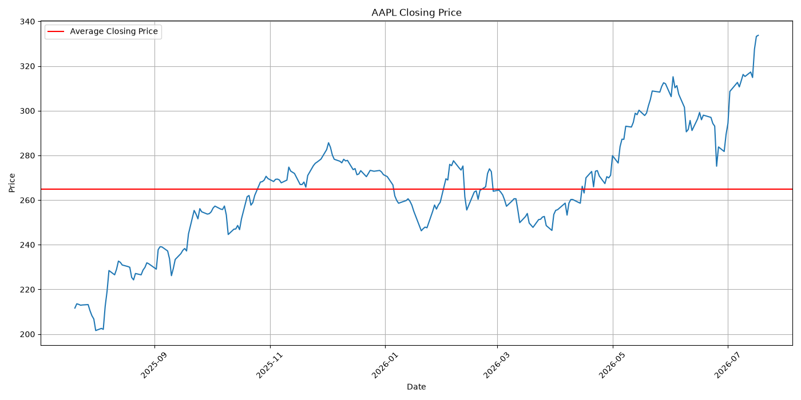
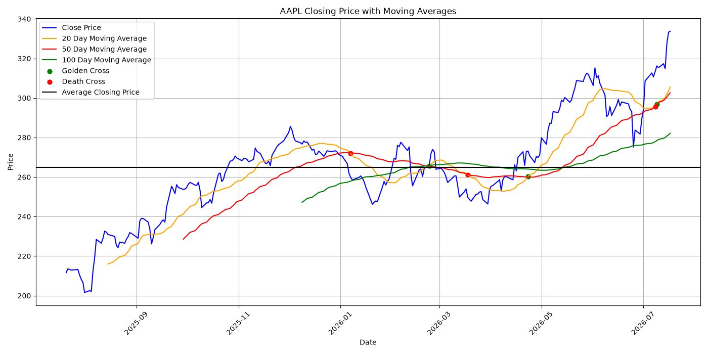
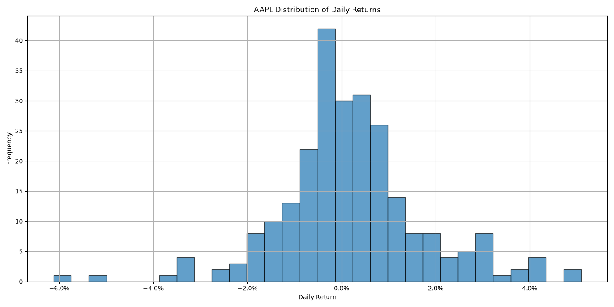
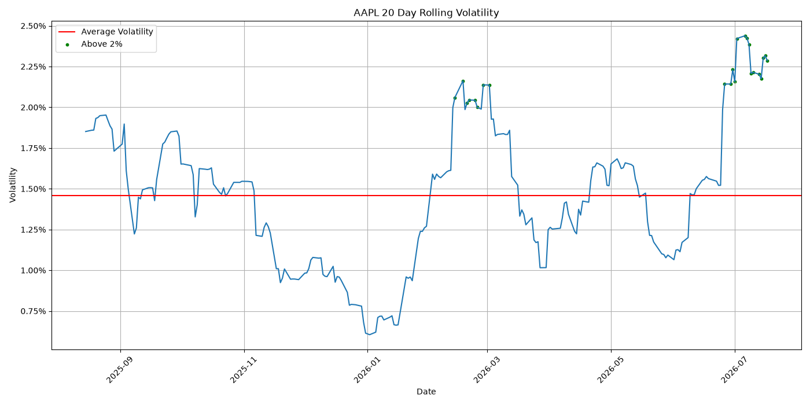

# Stock Market Analyzer

A python based financial data analysis tool which analyzes historical stock performance using Yahoo Finance data. 

Features
- Historical stock data using yfinance
-  Daily return statistical calculations
- Volatility analysis
- Rolling 20-day volatility
- Moving Averages (20, 50, and 100 days)
- Golden Cross and Death Cross detection
- Maxmimum Drawback
- Volume analysis
- Stock comparison
- Data visualization of all data calculations with matplotlib

Technologies Used 
- Python
- Pandas
- Numpy
- Matplotlib
- yfinance

Example Metrics 
The program calculates:
- Average Daily Return
- Median Daily Return
- Largest gains and losses
- Cumulative return - Winning and loosing streaks
- Trading volume statistics
- Volatility trends
- Maxmimum drawdown

Purpose 
This project explores quantitative finance concepts: 
- Risk measurement
- Market volatility
- Technical indicators
- Time series analysis 

## Visualizations

### Closing Price Analysis

### Moving Average Analysis

### Daily Return Distribution

### Volatility Analysis

